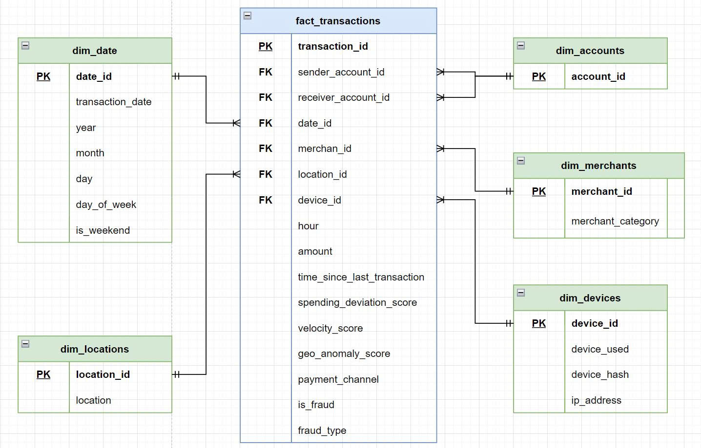

# Financial Transactions Fraud Detection - Hệ Thống Phát Hiện Gian Lận Tài Chính

<div align="center">


**Dự án tập trung xây dựng và tối ưu hóa cơ sở dữ liệu quan hệ cho hệ thống phát hiện gian lận tài chính**

</div>

---

## 📋 Thông Tin Dự Án

**Học Phần:** Hệ Quản Trị Cơ Sở Dữ Liệu (DBMS)  
**Nhóm 4 Thành Viên:**

| STT | Tên Thành Viên                 | Mã Sinh Viên |
| --- | ------------------------------ | ------------ |
| 1   | Lê Văn An                      | 056205001827 |
| 2   | Trần Tô Khắc Huy (Nhóm trưởng) | 082205009536 |
| 3   | Nguyễn Đức Long                | 064205001013 |
| 4   | Trần Phước Lộc                 | 079205009997 |

---

## 📌 Tổng Quan Dự Án

Dự án tập trung vào **thiết kế, xây dựng và tối ưu hóa cơ sở dữ liệu quan hệ** sử dụng **PostgreSQL** trên nền tảng cloud **AWS RDS** nhằm quản lý và xử lý dữ liệu giao dịch tài chính.

Nguồn dữ liệu được sử dụng là bộ **Financial Transactions Dataset for Fraud Detection** từ Kaggle, bao gồm thông tin chi tiết về các giao dịch và nhãn phát hiện gian lận (`is_fraud`). Dữ liệu được xử lý qua các bước:

1. **Làm sạch và chuẩn hóa** dữ liệu thô
2. **Trực quan hóa** để phân tích khám phá (EDA)
3. **Thiết kế schema** theo mô hình Star Schema
4. **Tối ưu hóa** thông qua indexing và partitioning
5. **Ứng dụng Machine Learning** cho phát hiện gian lận

Trọng tâm chính của dự án là **xây dựng hệ thống cơ sở dữ liệu hiệu năng cao** trên môi trường cloud thực tế, với tập trung vào các kỹ thuật tối ưu cơ sở dữ liệu tiên tiến.

---

## 🛠️ Công Nghệ Sử Dụng

### Backend & Database

- **PostgreSQL** - Hệ quản trị cơ sở dữ liệu quan hệ
- **AWS RDS** - Dịch vụ cơ sở dữ liệu quản lý trên cloud
- **SQL** - Ngôn ngữ truy vấn cấu trúc

### Data Processing & Analysis

- **Python 3.10+** - Ngôn ngữ lập trình chính
- **Pandas** - Xử lý và phân tích dữ liệu
- **NumPy** - Tính toán số học
- **Scikit-learn** - Xây dựng mô hình machine learning
- **XGBoost** - Gradient boosting
- **Imbalanced-learn** - Xử lý dữ liệu không cân bằng

### Visualization & Reporting

- **Matplotlib** - Vẽ biểu đồ cơ bản
- **Seaborn** - Trực quan hóa dữ liệu thống kê

### Development Tools

- **Jupyter Notebook** - Môi trường tính toán tương tác
- **Git** - Quản lý phiên bản
- **VS Code** - Trình soạn thảo mã

---

## 📁 Cấu Trúc Dự Án

```
Financial Transactions Fraud Detection/
├── README.md                          # Tài liệu dự án (tệp này)
├── .gitignore                         # Quy tắc loại trừ Git
│
├── 📊 notebooks/                      # Jupyter Notebooks - Phân tích và xử lý dữ liệu
│   ├── 1-clean-dataset.ipynb         # Làm sạch và chuẩn hóa dữ liệu
│   ├── 2-data-visualization.ipynb    # Khám phá và trực quan hóa dữ liệu
│   └── 3-machine-learning.ipynb      # Xây dựng và đánh giá mô hình ML
│
├── 🗄️ database/                      # Tệp SQL - Thiết kế cơ sở dữ liệu
│   ├── 01_schema.sql                 # Tạo cấu trúc bảng (Star Schema)
│   ├── 02_load.sql                   # Nạp dữ liệu từ CSV
│   └── 03_index.sql                  # Tạo index tối ưu hóa
│
├── 📈 data/                          # Dữ liệu xử lý
│   ├── financial_fraud_detection_dataset.csv  # Dữ liệu gốc từ Kaggle
│   ├── dim_date.csv                  # Bảng chiều - Ngày
│   ├── dim_merchants.csv             # Bảng chiều - Nhà cung cấp
│   ├── dim_locations.csv             # Bảng chiều - Vị trí
│   ├── dim_devices.csv               # Bảng chiều - Thiết bị
│   └── fact_transactions.csv         # Bảng sự kiện - Giao dịch
│
├── 📚 assets/                        # Tài liệu hình ảnh
│   ├── DBMS - Workflow.png          # Sơ đồ quy trình dự án
│   └── star_schema.jpg              # Sơ đồ Star Schema
│
├── docs/                            # Tài liệu bổ sung
├── checkpoint/                      # Checkpoint mô hình
└── fraud_detection_venv/            # Virtual environment Python
```

---

## 📊 Kiến Trúc Cơ Sở Dữ Liệu

### Star Schema Design



Dự án sử dụng **mô hình Star Schema** bao gồm:

**Bảng Sự Kiện (Fact Table):**

- `fact_transactions` - Lưu trữ thông tin chi tiết về các giao dịch tài chính với các thuộc tính như số tiền, loại gian lận, điểm bất thường địa lý, vận tốc giao dịch, v.v.

**Bảng Chiều (Dimension Tables):**

- `dim_date` - Thông tin về ngày tháng, năm, tháng, ngày trong tuần, và cuối tuần
- `dim_merchants` - Thông tin về nhà cung cấp dịch vụ và danh mục
- `dim_locations` - Thông tin về vị trí địa lý
- `dim_devices` - Thông tin về thiết bị được sử dụng, hash thiết bị, và địa chỉ IP

---

## 📝 Chi Tiết Các Phần Dự Án

### 1️⃣ **Làm Sạch Dữ Liệu** (`1-clean-dataset.ipynb`)

Notebook này thực hiện:

- **Load dữ liệu** từ file CSV
- **Kiểm tra chất lượng** dữ liệu (missing values, outliers, duplicates)
- **Chuẩn hóa dữ liệu** (normalize, standardize)
- **Xử lý missing values** và outliers
- **Tạo dữ liệu chiều** từ dữ liệu gốc:
  - Trích xuất ngày, tháng, năm, ngày trong tuần
  - Nhóm các nhà cung cấp, vị trí, thiết bị
- **Xuất dữ liệu** dạng CSV cho database

**Output:**

- `dim_date.csv`, `dim_merchants.csv`, `dim_locations.csv`, `dim_devices.csv`, `fact_transactions.csv`

---

### 2️⃣ **Trực Quan Hóa Dữ Liệu** (`2-data-visualization.ipynb`)

Notebook này tạo các biểu đồ khám phá dữ liệu (EDA):

- **Phân bố giao dịch** theo thời gian (năm, tháng, ngày)
- **Phân tích gian lận** - Tỷ lệ giao dịch gian lận vs hợp pháp
- **Phân bố số tiền giao dịch** (histogram, distribution)
- **Gian lận theo danh mục** nhà cung cấp
- **Phân tích theo vị trí địa lý**
- **Mối quan hệ giữa các biến** (correlation matrix)
- **Các biểu đồ so sánh** giữa giao dịch gian lận và hợp pháp

**Công cụ:** Matplotlib, Seaborn

---

### 3️⃣ **Cơ Sở Dữ Liệu** (folder `database/`)

#### **01_schema.sql** - Thiết kế Schema

- Tạo 4 bảng chiều (dimension tables)
- Tạo 1 bảng sự kiện (fact table)
- Định nghĩa khóa chính (Primary Key)
- Thiết lập tham chiếu khóa ngoài (Foreign Key)
- Thêm constraint kiểm tra (CHECK constraints)
- Sử dụng các kiểu dữ liệu phù hợp (NUMERIC, INET, BOOLEAN, etc.)

#### **02_load.sql** - Nạp Dữ Liệu

- Import dữ liệu từ các file CSV
- Sử dụng lệnh `COPY` của PostgreSQL
- Đảm bảo tính toàn vẹn dữ liệu với `BEGIN/COMMIT`

#### **03_index.sql** - Tối Ưu Hóa

Tạo các loại index để cải thiện hiệu năng:

**Single Column Index (Chỉ mục đơn):**

- `idx_fact_is_fraud` - Tối ưu truy vấn gian lận
- `idx_fact_date_id` - Tối ưu truy vấn theo thời gian
- `idx_fact_sender/receiver` - Tối ưu truy vấn theo tài khoản
- `idx_fact_merchant_id/location_id/device_id` - Tối ưu truy vấn chiều

**Composite Index (Chỉ mục kết hợp):**

- `idx_fact_fraud_date` - Kết hợp `is_fraud` + `date_id`
- `idx_date_year_month` - Kết hợp năm + tháng

**Partial Index (Chỉ mục một phần):**

- `idx_fact_fraud_type` - Chỉ index hàng có giá trị
- `idx_devices_hash/ip` - Chỉ index hàng không NULL

---

### 4️⃣ **Machine Learning** (`3-machine-learning.ipynb`)

Notebook thực hiện:

- **Load dữ liệu** từ fact_transactions
- **Feature Engineering** - Tạo các biến đặc trưng
- **Xử lý Class Imbalance** - Downsample lớp đa số
- **Xây dựng mô hình:**
  - Random Forest Classifier
  - XGBoost Classifier
- **Đánh giá mô hình:**
  - Train/Validation/Test split
  - Confusion Matrix
  - Classification Report (Precision, Recall, F1-Score)
  - ROC-AUC curve
  - Feature Importance

---

## Kết Quả Chính

### Cơ Sở Dữ liệu

✅ Thiết kế schema theo Star Schema  
✅ Tạo 12+ index tối ưu hóa  
✅ Đảm bảo tính toàn vẹn dữ liệu (constraints, foreign keys)  
✅ Triển khai trên AWS RDS  
✅ Tối ưu truy vấn với composite và partial index

### Machine Learning

- Mô hình Random Forest và XGBoost
- Xử lý class imbalance (downsampling)
- Feature importance analysis
- Evaluation metrics: Precision, Recall, F1-Score, AUC
